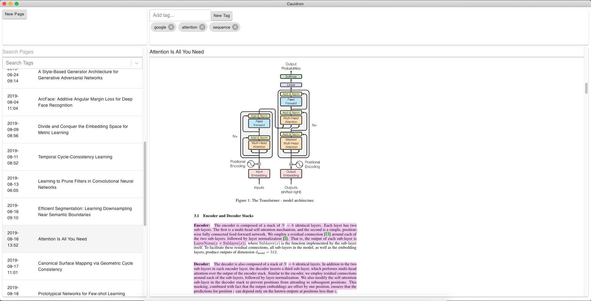

# Cauldron

An app to read, highlight, and tag PDFs.

Built in electron + react + redux.



# Install

This app requires the user to host their own firebase project. Installation involves
setting up a firebase project and putting the keys in the correct place.

## Install From .dmg

Download the latest .dmg from [here](https://github.com/kkihara/cauldron/releases/tag/v0.5.0).
Double click and drag to `Applications` to install.

Continue to Setting up Firebase.

## Build from source

```bash
cd cauldron
npm install
npm run release
open dist/Cauldron-vX.X.X.dmg
```

Continue to Setting up Firebase.

## Setting up Firebase

Setup a firebase account and create a new project. https://firebase.google.com/

Create the config directory.
```bash
mkdir -p ~/.config/cauldron
```

From the project dashboard go to
Settings (cog button) > Project Settings > General, add a web app.
Copy the config values to json into `~/.config/cauldron/config.json` into the key `firebase`.
```
{
  "firebase": { // config values goes here }
}
```

Next, from the project dashboard go to
Settings (cog button) > Project Settings > Service Accounts > Node.js > Generate a new private key.

Move the key to the config folder.
```bash
mv ~/Downloads/XXX.json ~/.config/cauldron
```

Add a reference to the key in `config.json`.
```
{
  "firebase": {
    "serviceAccountPath": "~/.config/cauldron/XXX.json",
    ...
  }
}
```

From the project dashboard now go to Authentication > Sign-in Method and enable email/password.
Now from Authentication > Users, create a user with email/password. Add the email/password to
the `config.json`. The final `config.json` should look like this:
```
{
  "firebase": {
    "serviceAccountPath": "~/.config.json/cauldron/XXX.json",
    "apiKey": "XXXXXXXXXXXXXXXX",
    "authDomain": "<project-id>.firebaseapp.com",
    "databaseURL": "https://<project-id>.firebaseio.com",
    "projectId": "<project-id>",
    "storageBucket": "<project-id>.appspot.com",
    "messagingSenderId": "123456789",
    "appId": "1:123456789:web:123456789"
  },
  "email": "email",
  "password": "password"
}
```

Finally, from the project dashboard Database > Data, create a collection called `pages`.
